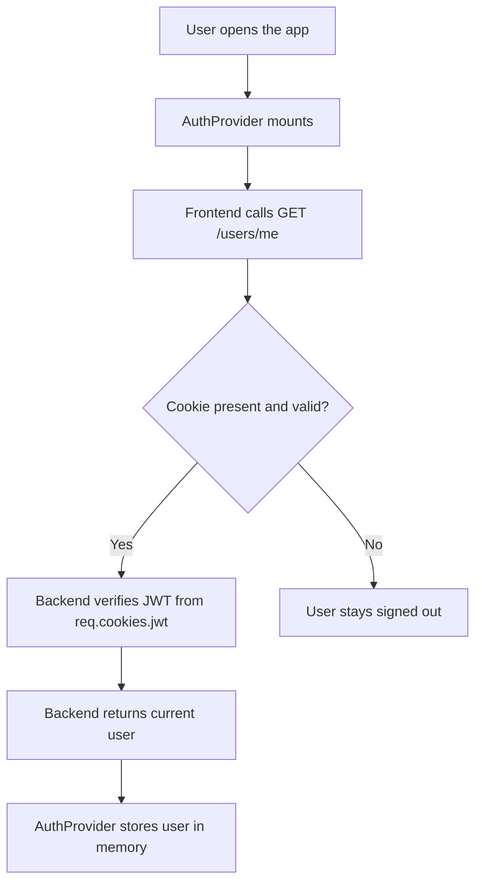
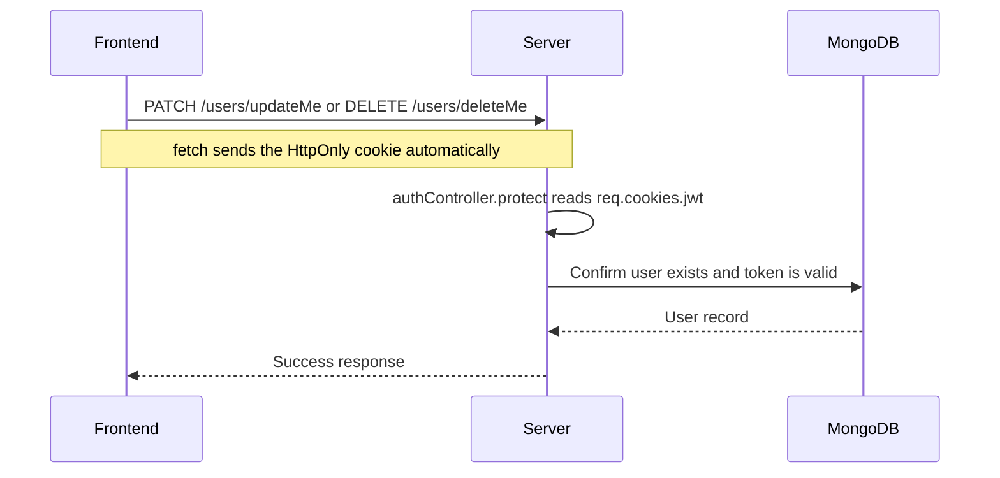

# Auth Flow: HttpOnly Cookie Session

This document explains how authentication works in the app after the switch from `localStorage` JWT storage to `HttpOnly` cookie-based auth.

## What Changed

The old flow stored the JWT in browser storage and attached it manually with an `Authorization: Bearer ...` header.

The new flow:

- Stores the JWT in an `HttpOnly` cookie on the server response.
- Sends cookies automatically with `fetch(..., { credentials: 'include' })`.
- Rebuilds the signed-in user state by calling `/users/me` on app startup.
- Logs out by clearing the cookie on the server and clearing client memory state.

## Why This Is Better

Using an `HttpOnly` cookie is safer than storing the JWT in `localStorage` because JavaScript cannot read the cookie. That makes token theft through XSS much harder.

## High-Level Flow



## Login and Signup Flow

```mermaid
sequenceDiagram
  participant U as User
  participant F as Frontend
  participant S as Server
  participant DB as MongoDB

  U->>F: Submit login or signup form
  F->>S: POST /users/login or /users/signup
  S->>DB: Verify user or create new user
  DB-->>S: User record
  S-->>F: JSON user data + Set-Cookie: jwt=...; HttpOnly
  F->>F: Store user in React session state
  F-->>U: Navigate into the app
```

## Protected Request Flow



## Logout Flow


## Scenario Walkthrough

Imagine Alice creates an account:

1. Alice opens the signup page.
2. She submits her name, email, and password.
3. The frontend sends `POST /users/signup`.
4. The backend creates the user and signs a JWT.
5. The backend sends the JWT back as an `HttpOnly` cookie.
6. The frontend stores only the user object in React state.
7. Alice refreshes the page.
8. `AuthProvider` mounts and calls `GET /users/me`.
9. The browser automatically includes the cookie.
10. The backend verifies the cookie, finds Alice, and returns her user record.
11. The app restores her signed-in state without ever reading a token from JavaScript.

## Key Backend Changes

### Cookie creation

```js
const getCookieOptions = () => {
  const isProduction = process.env.NODE_ENV === 'production';

  return {
    expires: new Date(
      Date.now() + process.env.JWT_COOKIE_EXPIRES_IN * 24 * 60 * 60 * 1000,
    ),
    httpOnly: true,
    sameSite: isProduction ? 'none' : 'lax',
    secure: isProduction,
    path: '/',
  };
};

const createSendToken = (user, statusCode, res) => {
  const token = signToken(user._id);

  res.cookie('jwt', token, getCookieOptions());
  user.password = undefined;

  res.status(statusCode).json({
    status: 'success',
    data: { user },
  });
};
```

### Logout route

```js
exports.logout = (req, res) => {
  res.cookie('jwt', 'loggedout', {
    ...getCookieOptions(),
    expires: new Date(Date.now() + 10 * 1000),
  });

  res.status(200).json({ status: 'success' });
};
```

### Cookie-aware auth middleware

```js
exports.protect = AsyncHandler(async (req, res, next) => {
  let token;

  if (
    req.headers.authorization &&
    req.headers.authorization.startsWith('Bearer')
  ) {
    token = req.headers.authorization.split(' ')[1];
  } else if (req.cookies.jwt) {
    token = req.cookies.jwt;
  }

  if (!token) {
    return next(
      new AppError('You are not logged in! Please log in to get access.', 401),
    );
  }

  const decoded = await promisify(jwt.verify)(token, process.env.JWT_SECRET);
  const currentUser = await User.findById(decoded.id);

  if (!currentUser) {
    return next(
      new AppError('The user belonging to this token no longer exists.', 401),
    );
  }

  if (currentUser.changedPasswordAfter(decoded.iat)) {
    return next(
      new AppError('User recently changed password! Please log in again.', 401),
    );
  }

  req.user = currentUser;
  next();
});
```

## Key Frontend Changes

### API client sends cookies

```js
async function request(path, options = {}) {
  const { headers = {}, ...rest } = options;

  const response = await fetch(`${API_ROOT}${path}`, {
    credentials: 'include',
    headers: {
      'Content-Type': 'application/json',
      ...headers,
    },
    ...rest,
  });
}
```

### Session state is in memory

```js
export function setSession(user) {
  currentSession = user ? { user } : null;

  if (typeof window === 'undefined') return;

  emitSessionChange(currentSession);
}

export function loadSession() {
  return currentSession;
}

export function clearSession() {
  currentSession = null;

  if (typeof window === 'undefined') return;

  emitSessionChange(null);
}
```

### App hydration on load

```js
useEffect(() => {
  let isMounted = true;

  const hydrateSession = async () => {
    try {
      const res = await fetchCurrentUser();
      const user = res?.data?.user ?? res?.user ?? null;

      if (!isMounted) return;

      if (user) {
        setSession(user);
        setSessionState(loadSession());
      } else {
        clearSession();
        setSessionState(null);
      }
    } catch {
      if (!isMounted) return;
      clearSession();
      setSessionState(null);
    } finally {
      if (isMounted) {
        setLoading(false);
      }
    }
  };

  hydrateSession();

  return () => {
    isMounted = false;
  };
}, []);
```

## What Happens On Refresh


## What Happens On Logout


## Important Notes

- The JWT is no longer stored in `localStorage`.
- The browser must send cookies with requests, so `credentials: 'include'` is required.
- The backend must allow credentialed CORS requests.
- The app still keeps the user object in memory so the UI can render quickly.
- On a full refresh, the app asks the server to rebuild auth state.

## Files Involved

- `backend/controllers/authController.js`
- `backend/Router/userRoutes.js`
- `backend/app.js`
- `frontend/src/utils/api.js`
- `frontend/src/utils/session.js`
- `frontend/src/app/auth.jsx`
- `frontend/src/pages/LoginPage/LoginPage.jsx`
- `frontend/src/pages/SignupPage/SignupPage.jsx`
- `frontend/src/pages/ProfilePage/ProfilePage.jsx`
- `frontend/src/components/Navbar/Navbar.jsx`

## Short Summary

The client no longer owns the JWT. The server sets it in an `HttpOnly` cookie, the browser sends it automatically, and the frontend only keeps the current user object in memory for UI rendering.
